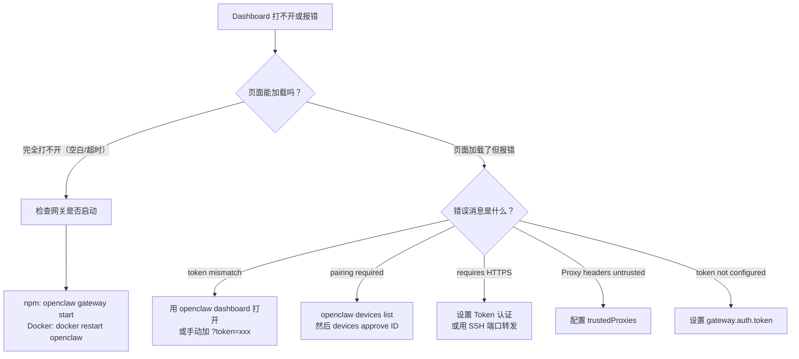

# 常见问题排查手册

遇到问题？按错误消息搜索本页，或按场景分类查找解决方案。

> 返回 [README](../README.md) | [Docker 部署指南](DOCKER_GUIDE.md)

---

## 目录

- [零、紧急修复](#零紧急修复) ⚠️
- [一、安装问题](#一安装问题)
- [二、启动问题](#二启动问题)
- [三、Dashboard 连不上](#三dashboard-连不上)
- [四、内网 / 远程访问](#四内网--远程访问)
- [五、模型和对话](#五模型和对话)
- [六、其他问题](#六其他问题)

---

## 零、紧急修复

### Missing workspace template: AGENTS.md

**你会看到**：
```
Error: Missing workspace template: AGENTS.md (C:\Users\xxx\docs\reference\templates\AGENTS.md). 
Ensure docs/reference/templates are packaged.
```

**影响版本**：`2026.2.4-zh.1` 及更早版本

**原因**：汉化版在构建时修改了包名为 `@qingchencloud/openclaw-zh`，但上游代码中有一处硬编码只识别 `openclaw` 包名，导致运行时无法定位模板文件、Dashboard 资源、技能目录等关键路径。

**解决方案**：

```bash
# 升级到最新版（已修复）
npm install -g @qingchencloud/openclaw-zh@latest

# 如果使用 nightly 版
npm install -g @qingchencloud/openclaw-zh@nightly
```

此 Bug 已在 `2026.2.4-zh.2` 版本修复。如果升级后仍有问题，请尝试完全重装：

```bash
npm uninstall -g @qingchencloud/openclaw-zh
npm install -g @qingchencloud/openclaw-zh@latest
```

---

## 一、安装问题

### 安装卡住不动 / 下载很慢

**你会看到**：运行安装脚本后长时间没有反应，或 npm install 进度条不动。

**原因**：npm 默认从国外源下载，中国大陆网络访问慢。

**解决方案**：

```bash
# 方法1：使用淘宝镜像源安装（推荐）
npm install -g @qingchencloud/openclaw-zh@latest --registry=https://registry.npmmirror.com

# 方法2：先切换全局镜像源，再安装
npm config set registry https://registry.npmmirror.com
npm install -g @qingchencloud/openclaw-zh@latest
```

如果是 Docker 镜像拉取慢，参考 [Docker 部署指南](DOCKER_GUIDE.md) 中的镜像加速方案。

---

### `Control UI assets not found`

**你会看到**：终端输出类似：
```
Control UI assets not found. Build them with `pnpm ui:build` (auto-installs UI deps), or run `pnpm ui:dev` during development.
```

**原因**：你可能安装了原版 `openclaw` 而不是汉化版，或者安装过程中断导致文件不完整。

**解决方案**：

```bash
# 第1步：卸载所有版本
npm uninstall -g openclaw
npm uninstall -g @qingchencloud/openclaw-zh

# 第2步：清除 npm 缓存
npm cache clean --force

# 第3步：重新安装汉化版
npm install -g @qingchencloud/openclaw-zh@latest

# 第4步：验证安装
openclaw --version
```

> 如果仍然报错，检查你的 Node.js 版本是否 >= 22：`node -v`

---

### `MODULE_NOT_FOUND` / systemd 服务路径错误

**你会看到**：服务启动失败，日志显示：
```
Error: Cannot find module '/home/xxx/.npm-global/lib/node_modules/openclaw/dist/index.js'
```

**原因**：systemd 服务配置文件中写的路径是原版 `openclaw` 的路径，但你安装的是汉化版 `@qingchencloud/openclaw-zh`，两者的路径不同。

**解决方案**：

```bash
# 第1步：找到汉化版的实际安装路径
which openclaw
# 或者
npm list -g @qingchencloud/openclaw-zh --depth=0

# 第2步：重新安装守护进程（会自动修复路径）
openclaw onboard --install-daemon

# 第3步：检查服务状态
systemctl --user status openclaw-gateway
```

如果 `onboard --install-daemon` 不能修复，手动编辑 systemd 文件：
```bash
# 查看当前配置
systemctl --user cat openclaw-gateway

# 编辑，将 ExecStart 路径改为实际路径
systemctl --user edit openclaw-gateway --force

# 重载并重启
systemctl --user daemon-reload
systemctl --user restart openclaw-gateway
```

---

### 安装后运行还是英文

**你会看到**：运行 `openclaw --help` 或打开 Dashboard，界面仍然是英文。

**原因**：系统中同时存在原版 `openclaw` 和汉化版，命令调用的是原版。

**解决方案**：

```bash
# 先卸载原版
npm uninstall -g openclaw

# 再安装汉化版
npm install -g @qingchencloud/openclaw-zh@latest

# 验证（应显示汉化版版本号，如 2026.2.4-zh.1）
openclaw --version
```

---

## 二、启动问题

### `Missing config. Run openclaw setup`

**你会看到**：启动时终端输出：
```
Missing config. Run `openclaw setup` or set gateway.mode=local (or pass --allow-unconfigured).
```

**原因**：首次运行没有执行初始化，或配置文件被删除。

**解决方案**：

**npm 环境：**
```bash
# 运行初始化向导
openclaw onboard
```

**Docker 环境：**
```bash
# 在容器内执行初始化
docker exec -it openclaw openclaw setup

# 设置网关模式
docker exec openclaw openclaw config set gateway.mode local

# 重启容器
docker restart openclaw
```

> 如果是 docker-compose，将 `docker exec openclaw` 替换为 `docker-compose exec openclaw`

---

### `gateway.mode is unset`

**你会看到**：Doctor 诊断输出：
```
gateway.mode 未设置；网关启动将被阻止。
```

**原因**：配置中缺少 `gateway.mode` 字段。

**解决方案**：

```bash
# npm 环境
openclaw config set gateway.mode local

# Docker 环境
docker exec openclaw openclaw config set gateway.mode local
docker restart openclaw
```

---

### `Invalid config` / `Unrecognized keys`

**你会看到**：启动时报错：
```
Invalid config at /root/.openclaw/openclaw.json:
- <root>: Unrecognized keys: "gatewayToken", "port", ...
```

**原因**：配置文件格式过旧，包含新版本不识别的字段（通常是从旧版升级后出现）。

**解决方案**：

```bash
# 方法1：用 doctor 自动修复
openclaw doctor

# 方法2：备份并重建配置
cp ~/.openclaw/openclaw.json ~/.openclaw/openclaw.json.bak
openclaw setup
```

**Docker 环境：**
```bash
docker exec openclaw openclaw doctor
# 或备份后重建
docker exec openclaw cp /root/.openclaw/openclaw.json /root/.openclaw/openclaw.json.bak
docker exec -it openclaw openclaw setup
docker restart openclaw
```

---

### Docker 容器一直重启

**你会看到**：`docker ps` 显示容器状态为 `Restarting`，或 `docker logs` 反复输出错误。

**原因**：通常是配置未初始化。

**解决方案**：

```bash
# 第1步：查看日志找到具体错误
docker logs openclaw

# 第2步：根据日志中的错误消息，对照本文档找到对应解决方案

# 最常见情况：重新初始化配置
docker stop openclaw && docker rm openclaw

docker run --rm -v openclaw-data:/root/.openclaw \
  ghcr.io/1186258278/openclaw-zh:latest openclaw setup

docker run --rm -v openclaw-data:/root/.openclaw \
  ghcr.io/1186258278/openclaw-zh:latest openclaw config set gateway.mode local

docker run -d --name openclaw -p 18789:18789 \
  -v openclaw-data:/root/.openclaw --restart unless-stopped \
  ghcr.io/1186258278/openclaw-zh:latest openclaw gateway run
```

---

### `Gateway not running` / 网关未运行

**你会看到**：运行 `openclaw doctor` 提示"网关未运行"，或 Dashboard 无法访问。

**原因**：网关进程没有启动或已退出。

**解决方案**：

```bash
# npm 环境：启动网关
openclaw gateway start

# 或安装守护进程（推荐，会开机自启）
openclaw onboard --install-daemon

# Docker 环境：重启容器
docker restart openclaw
```

---

## 三、Dashboard 连不上

遇到 Dashboard 无法连接？按下面的流程图排查：



---

### `gateway token mismatch` / `unauthorized`

**你会看到**：Dashboard 右下角红色提示：
```
disconnected (1008): unauthorized: gateway token mismatch
```

**原因**：你访问 Dashboard 时没有带正确的 Token，或 Token 不匹配。

**解决方案**：

```bash
# 方法1（推荐）：用命令自动打开带 Token 的 URL
openclaw dashboard

# Docker 环境：获取带 Token 的 URL
docker exec openclaw openclaw dashboard --print-url
# 复制输出的 URL 到浏览器打开
```

**手动方法**：
```bash
# 查看你的 Token
openclaw config get gateway.auth.token
# Docker: docker exec openclaw openclaw config get gateway.auth.token

# 在浏览器地址栏输入：
# http://localhost:18789?token=你的Token值
```

---

### `pairing required` / 设备配对

**你会看到**：Dashboard 显示：
```
disconnected (1008): pairing required
```

**原因**：这是 OpenClaw 的安全机制。每个浏览器首次连接都需要管理员批准。

**解决方案**：

```bash
# 第1步：查看待批准的设备
openclaw devices list
# Docker: docker exec openclaw openclaw devices list --password '你的Token'

# 第2步：复制 Request ID，批准它
openclaw devices approve 693d5641-xxxx-xxxx-xxxx-xxxxxxxxxxxx
# Docker: docker exec openclaw openclaw devices approve 693d5641-xxxx-xxxx-xxxx-xxxxxxxxxxxx

# 第3步：回到 Dashboard，点击「连接」
```

> 注意：清除浏览器缓存、换浏览器、用无痕模式都会生成新的设备 ID，需要重新批准。

---

### `control ui requires HTTPS or localhost`

**你会看到**：Dashboard 显示安全限制提示。

**原因**：你通过 HTTP（非 localhost）访问 Dashboard，浏览器阻止了设备身份验证功能。

**解决方案**（任选一种）：

**方案1：设置 Token 认证（最简单）**
```bash
# npm 环境
openclaw config set gateway.auth.token 你的密码
openclaw gateway restart

# Docker 环境
docker exec openclaw openclaw config set gateway.auth.token 你的密码
docker restart openclaw

# 然后在 Dashboard 的「网关令牌」输入框填入你的密码
```

**方案2：SSH 端口转发（更安全）**
```bash
ssh -L 18789:127.0.0.1:18789 user@服务器IP
# 然后访问 http://localhost:18789（走的是加密隧道）
```

**方案3：配置 HTTPS 反向代理**

参考 [Docker 部署指南 - Nginx 反代](DOCKER_GUIDE.md#nginx--https-反向代理)

---

### `Proxy headers detected from untrusted address`

**你会看到**：使用 Nginx 反向代理后，Dashboard 报此错误。

**原因**：OpenClaw 检测到反向代理的请求头，但代理的 IP 不在信任列表中。

**解决方案**：

```bash
# npm 环境
openclaw config set gateway.trustedProxies '["127.0.0.1", "::1"]'
openclaw gateway restart

# Docker 环境
docker exec openclaw openclaw config set gateway.trustedProxies '["127.0.0.1", "::1"]'
docker restart openclaw
```

> 如果 Nginx 和 OpenClaw 不在同一台机器，把 `127.0.0.1` 换成 Nginx 服务器的 IP。

---

### `Gateway auth is set to token, but no token is configured`

**你会看到**：启动日志中出现此警告。

**原因**：网关认证模式设为 Token，但没有配置 Token 值。

**解决方案**：

```bash
# npm 环境
openclaw config set gateway.auth.token 你的密码

# Docker 环境
docker exec openclaw openclaw config set gateway.auth.token 你的密码
docker restart openclaw

# 或通过环境变量设置
export OPENCLAW_GATEWAY_TOKEN=你的密码
```

---

## 四、内网 / 远程访问

### npm 安装后，内网其他电脑无法访问

**你会看到**：在服务器上安装后，本机 `localhost:18789` 能打开，但内网其他电脑访问 `http://服务器IP:18789` 失败。

**原因**：默认情况下，网关只监听 `127.0.0.1`（本机回环），不接受来自外部的连接。

**解决方案**：

```bash
# 第1步：配置网关监听局域网
openclaw config set gateway.bind lan

# 第2步：设置访问密码（必须，否则外部访问会被拒绝）
openclaw config set gateway.auth.token 你的密码

# 第3步：重启网关
openclaw gateway restart

# 第4步（可选）：安装守护进程，让 OpenClaw 开机自启
openclaw onboard --install-daemon
```

然后在其他电脑上访问 `http://服务器IP:18789`，在「网关令牌」输入你设的密码。

**还是访问不了？检查防火墙**：
```bash
# Ubuntu / Debian
sudo ufw allow 18789

# CentOS / RHEL
sudo firewall-cmd --add-port=18789/tcp --permanent && sudo firewall-cmd --reload

# Windows
netsh advfirewall firewall add rule name="OpenClaw" dir=in action=allow protocol=TCP localport=18789
```

---

### Docker 远程部署后访问不了

**你会看到**：Docker 容器启动成功，但从其他机器访问 `http://服务器IP:18789` 没反应。

**检查清单**：

1. **容器是否在运行？** `docker ps | grep openclaw`
2. **端口是否映射了？** 确认 `-p 18789:18789` 参数
3. **网关模式是否设置了？** `docker exec openclaw openclaw config get gateway.mode`
4. **是否绑定了局域网？** `docker exec openclaw openclaw config get gateway.bind`
5. **防火墙是否放行了？** 参考上面的防火墙命令

**一次性修复**：
```bash
docker exec openclaw openclaw config set gateway.mode local
docker exec openclaw openclaw config set gateway.bind lan
docker exec openclaw openclaw config set gateway.auth.token 你的密码
docker restart openclaw
```

---

### Docker 远程访问是否必须用 HTTPS？

**不是必须的。** 设置 Token 认证就可以通过 HTTP 远程访问。

```bash
docker exec openclaw openclaw config set gateway.auth.token 你的密码
docker restart openclaw
```

然后在 Dashboard 的「网关令牌」输入框填入密码即可。

只有在不设 Token 的情况下，浏览器才会因为安全策略（Web Crypto API 需要 HTTPS）阻止连接。

---

## 五、模型和对话

### 本地 Ollama 模型调用无响应

**你会看到**：在 Dashboard 的对话界面输入消息后，没有任何回复，也没有报错。

**排查步骤**：

```bash
# 第1步：确认 Ollama 正在运行
curl http://localhost:11434/api/tags
# 应返回已安装的模型列表

# 第2步：确认 OpenClaw 配置了正确的模型
openclaw config get agents.defaults.model
# Docker: docker exec openclaw openclaw config get agents.defaults.model

# 第3步：确认模型地址配置正确
openclaw config get auth.openai.baseURL
# 应为 http://localhost:11434/v1（注意末尾的 /v1）
```

**配置 Ollama**：
```bash
# 设置模型（替换为你的模型名）
openclaw config set agents.defaults.model openai/llama3.2

# 设置 Ollama API 地址
openclaw config set auth.openai.baseURL http://localhost:11434/v1
openclaw config set auth.openai.apiKey ollama
```

> Docker 环境中 `localhost` 指的是容器内部。如果 Ollama 在宿主机运行，请用 `host.docker.internal` 替代 `localhost`：
> ```bash
> docker exec openclaw openclaw config set auth.openai.baseURL http://host.docker.internal:11434/v1
> ```

---

### 如何使用自定义的 OpenAI 兼容接口

**适用于**：OneAPI、New API、各种中转站、国产模型 API 等。

```bash
# 设置模型名（按实际模型填写）
openclaw config set agents.defaults.model openai/gpt-4o

# 设置自定义 API 地址
openclaw config set auth.openai.baseURL https://your-api.example.com/v1

# 设置 API Key
openclaw config set auth.openai.apiKey sk-your-api-key
```

> `baseURL` 末尾通常需要加 `/v1`，但具体取决于你的 API 服务。

---

### 对话语言是中文吗？

对话语言取决于你使用的 AI 模型，**与本汉化项目无关**。

- Claude、GPT-4 等主流模型都支持中文对话
- 你可以在系统提示中设置"请用中文回复"
- 本项目只汉化界面（CLI + Dashboard），不影响对话内容

---

## 六、其他问题

### 左上角图标不显示

**你会看到**：Dashboard 左上角的 OpenClaw Logo 显示为空白或破损图标。

**原因**：旧版本使用了外部 CDN 图标链接，网络不通导致加载失败。新版已修复。

**解决方案**：
```bash
npm update -g @qingchencloud/openclaw-zh
```

---

### 如何更新到最新版

```bash
# npm 用户
npm update -g @qingchencloud/openclaw-zh

# Docker 用户
docker pull ghcr.io/1186258278/openclaw-zh:latest
docker stop openclaw && docker rm openclaw
docker run -d --name openclaw -p 18789:18789 \
  -v openclaw-data:/root/.openclaw --restart unless-stopped \
  ghcr.io/1186258278/openclaw-zh:latest openclaw gateway run
```

> 查看当前版本：`openclaw --version`

---

### 如何切换回原版

```bash
npm uninstall -g @qingchencloud/openclaw-zh
npm install -g openclaw
```

---

### 如何彻底卸载

**Windows：**
```powershell
npm uninstall -g @qingchencloud/openclaw-zh
npm uninstall -g openclaw
Remove-Item -Recurse -Force "$env:USERPROFILE\.openclaw"   # 删除配置（可选）
```

**Linux / macOS：**
```bash
npm uninstall -g @qingchencloud/openclaw-zh
npm uninstall -g openclaw
rm -rf ~/.openclaw   # 删除配置（可选）
```

> 注意：`npm uninstall openclaw` 不会卸载汉化版，必须用完整包名 `@qingchencloud/openclaw-zh`

---

### Docker 权限问题 `EACCES: permission denied`

**你会看到**：容器启动或操作时报文件权限错误。

**原因**：使用了 bind mount（绑定宿主机目录）时，容器内用户没有写入权限。

**解决方案**：

```bash
# 推荐：使用 named volume 而不是 bind mount
docker run -d --name openclaw -p 18789:18789 \
  -v openclaw-data:/root/.openclaw \
  ghcr.io/1186258278/openclaw-zh:latest openclaw gateway run

# 如果必须用 bind mount，修复权限
sudo chown -R 1000:1000 /你的目录路径
```

---

### Docker 拉取镜像报 `denied` 或 `unauthorized`

```bash
# 清理登录缓存后重试
docker logout ghcr.io
docker pull ghcr.io/1186258278/openclaw-zh:latest
```

---

### 飞牛 NAS / 群晖等设备如何部署

可以使用 Docker 方式部署，参考 [Docker 部署指南](DOCKER_GUIDE.md)。

核心步骤：
1. 在 NAS 的 Docker 管理界面中拉取镜像 `ghcr.io/1186258278/openclaw-zh:latest`
2. 创建容器，端口映射 `18789:18789`，挂载数据卷
3. 进入容器终端执行 `openclaw setup` 初始化
4. 设置 `openclaw config set gateway.mode local`
5. 重启容器

---

> 没找到你的问题？请通过 [GitHub Issues](https://github.com/1186258278/OpenClawChineseTranslation/issues) 反馈，我们会尽快回复。

> 返回 [README](../README.md) | [Docker 部署指南](DOCKER_GUIDE.md)
